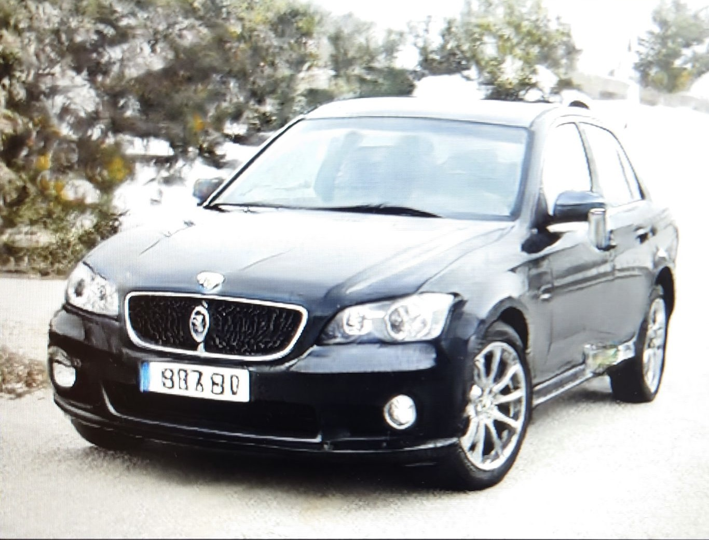
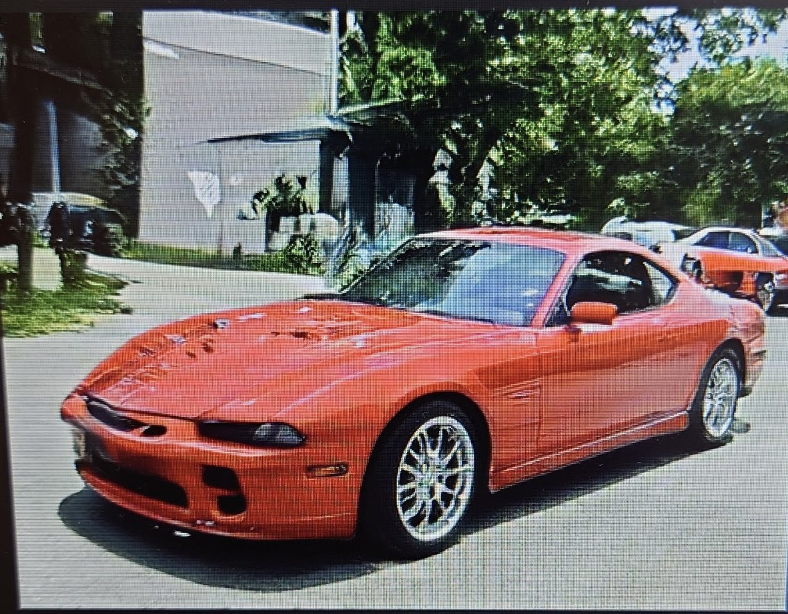
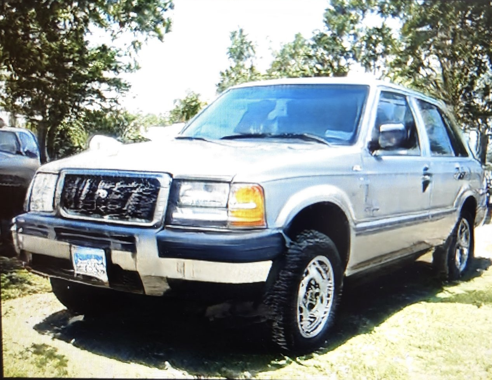

# DatasetGAN

This is the official code and data release for:

#### DatasetGAN: Efficient Labeled Data Factory with Minimal Human Effort

<sup>[Yuxuan Zhang*](https://www.alexyuxuanzhang.com/), [Huan Ling*](http://www.cs.toronto.edu/~linghuan/), [Jun Gao](http://www.cs.toronto.edu/~jungao/), [Kangxue Yin](https://kangxue.org/), [Jean-Francois Lafleche](), [Adela Barriuso](), [Antonio Torralba](https://groups.csail.mit.edu/vision/torralbalab/), [Sanja Fidler](http://www.cs.toronto.edu/~fidler/)<sup>

<sup>\* authors contributed equally <sup>

**CVPR'21, Oral** **[[paper](https://arxiv.org/abs/2104.06490)] [[supplementary](https://drive.google.com/file/d/1td1nP8FP0axHXFxl9_EXCtHQHhnaUQl8/view?usp=sharing)] [[Project Page](https://nv-tlabs.github.io/datasetGAN/)]**


      
   
## License

For any code dependency related to Stylegan, the license is under the [Creative Commons BY-NC 4.0](https://creativecommons.org/licenses/by-nc/4.0/) license by NVIDIA Corporation.  To view a copy of this license, visit [LICENSE](https://github.com/NVlabs/stylegan/blob/master/LICENSE.txt ).

The code of DatasetGAN is released under the MIT license. See [LICENSE](https://github.com/nv-tlabs/datasetGAN_release/blob/release_finallll/LICENSE.txt) for additional details.

The dataset of DatasetGAN is released under the [Creative Commons BY-NC 4.0](https://creativecommons.org/licenses/by-nc/4.0/) license by NVIDIA Corporation. You can **use, redistribute, and adapt** the material for **non-commercial purposes**, as long as you give appropriate credit by **citing our paper** and **indicating any changes** that you've made.

## Requirements

- Python 3.6  is supported.
- Pytorch 1.4.0.
- This code is tested with CUDA 10.1 toolkit and CuDNN 7.5.
- All results in our paper are based on Nvidia Tesla V100 GPUs with 32GB memory. 
- Please check the python package requirement from [`requirements.txt`](requirements.txt), and install using
```
pip install -r requirements.txt
```

- *Download Dataset from [google drive](https://drive.google.com/drive/folders/1Oa9XpyKnRSN5s9-ab2-5j3wvH374JOu8?usp=sharing)* and put it in the folder of ***./datasetGAN/dataset_release***. The cache npy files are explained in Section **Create your own model**.  Please be aware that the dataset of DatasetGAN is released under the [Creative Commons BY-NC 4.0](https://creativecommons.org/licenses/by-nc/4.0/) license by NVIDIA Corporation.

- *Download pretrained checkpoint from [Stylegan](https://github.com/NVlabs/stylegan) and convert the tensorflow checkpoint to pytorch. We also release the [pytorch checkpoint](https://drive.google.com/drive/folders/1Hhu8aGxbnUtK-yHRD9BXZ3gn3bNNmsGi?usp=sharing)  for your convenience. Put checkpoints in the folder of **./checkpoint/stylegan_pretrain***. Please be aware that the any code dependency and checkpoint related to Stylegan, the license is under the [Creative Commons BY-NC 4.0](https://creativecommons.org/licenses/by-nc/4.0/) license by NVIDIA Corporation.  


## Result images
**Non-existent car images generated by GAN.
      
      



      
## Annotation images

      
